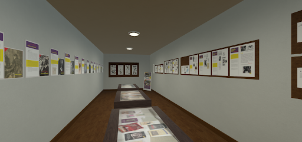
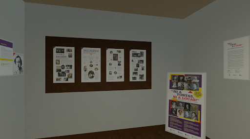

# Ni a Tontas Ni a Locas VR

## Descripción del proyecto
Este proyecto tiene como objetivo trasladar a realidad virtual (VR) la exposición «¡Ni a tontas ni a locas! Mujeres singulares en los entornos de Negrín», organizada por la Fundación Juan Negrín en su sede de Las Palmas de Gran Canaria. La muestra está dedicada a 17 mujeres destacadas que formaron parte de los diversos entornos vitales de Juan Negrín. Estas mujeres fueron escritoras, políticas, científicas, periodistas, pensadoras, artistas, funcionarias, activistas y milicianas.

Para llevar a cabo esta adaptación, se utilizaron los contenidos originales de la exposición. Tras convertir los archivos PDF en imágenes, se utilizaron herramientas de Unity para transformar dichas imágenes en materiales adecuados para su visualización dentro de la escena virtual.

Gracias al uso del XR Interaction Toolkit de Unity, se desarrolló una experiencia inmersiva en VR que sitúa al usuario dentro de una sala expositiva. En este entorno, el visitante puede acercarse a los distintos contenidos y leer los documentos, aprendiendo sobre la vida y legado de estas mujeres singulares.

## Tecnologías
- Unity
- XR Interaction Toolkit
- Meta Quest 3
- C#

## Instalación
1. Clona este repositorio.
```bash
   git clone https://github.com/tu_usuario/ni-a-tontas-ni-a-locas-vr.git
```
2. Abre el proyecto en Unity.
3. Asegúrate de tener instalado el XR Interaction Toolkit.
4. Configura el proyecto para Meta Quest 3.

## Controles
- Joystick izquierdo: Movimiento.
- Joystick derecho: Giro de cámara.
- Joystick derecho hacia adelante: Indicador de teletransporte (apuntar al suelo para teletransportarse).
- Joystick derecho hacia atrás: Giro rápido de 180 grados.

## Capturas de pantalla



## Licencia
Este proyecto está bajo la licencia MIT. Consulta el archivo LICENSE para más información.

## Créditos
- Fundación Juan Negrín por los contenidos originales de la exposición.

## Contacto
Para cualquier duda o sugerencia, contacta a través de jcojaney@gmail.com
